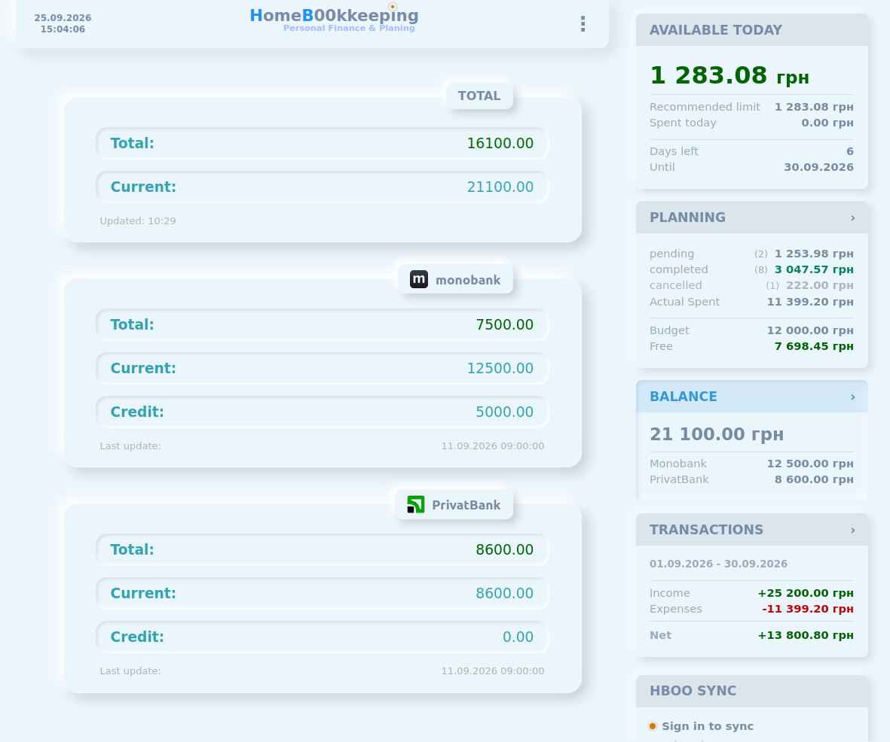
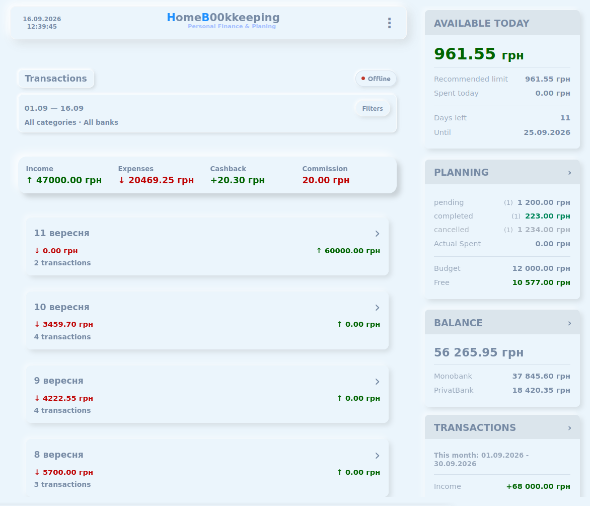
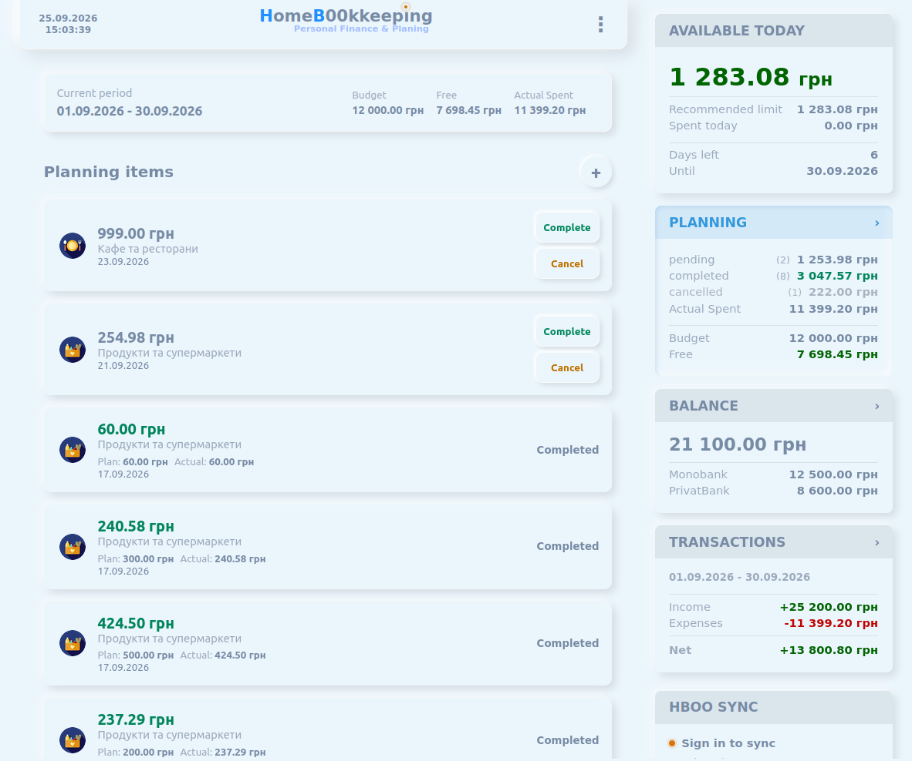
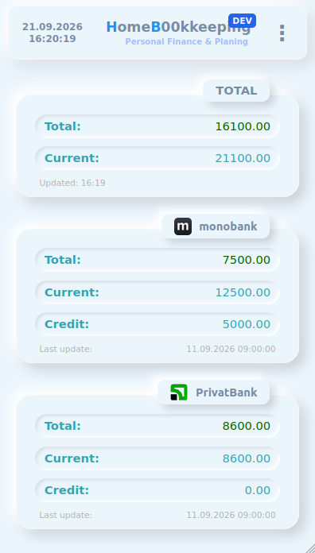
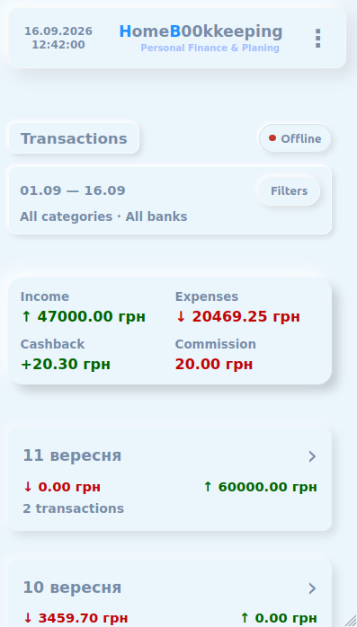
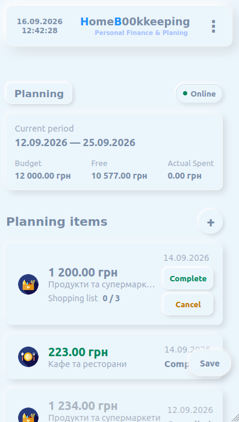

# HBOO — Home Bookkeeping

A personal finance application for managing bank balances, transactions, and financial plans.

HBOO started as a personal project for working with my own financial data and gradually evolved from a simple bank balance viewer into a broader financial planning application.

## Repository Structure

```text
frontend/
    Vanilla JavaScript HBOO client

backend/
    Pure Node.js REST API

bank-service/
    Spring Boot bank integration service

docker/
    Docker / Nginx / MySQL infrastructure

compose.yaml
    Local application environment

.env.example
    Example environment configuration without secrets
```

## Local Development with Docker

Primary local development runs the current vanilla JavaScript frontend through Nginx with local HTTPS.

Prerequisites:

- Docker
- Docker Compose
- mkcert

The web document root is `frontend/`. Public URLs do not include `/frontend/`:

```text
https://hboo.local/
https://hboo.local/hbapp/index.js
https://hboo.local/hbapp/assets/styles/main.css
```

Configure the local hostname on the development machine:

```bash
sudo sh -c 'echo "127.0.0.1 hboo.local" >> /etc/hosts'
```

Generate local HTTPS certificates:

```bash
LAN_IP="$(ip route get 1.1.1.1 | awk '{print $7; exit}')"

mkcert -install
mkcert \
  -cert-file docker/nginx/certs/hboo.local.pem \
  -key-file docker/nginx/certs/hboo.local-key.pem \
  hboo.local "$LAN_IP"
```

Start the environment:

```bash
docker compose up -d
```

Open on the development machine:

```text
https://hboo.local/
```

Open from another device on the same Wi-Fi network:

```text
https://<developer-lan-ip>/
```

The mkcert local CA must also be installed and trusted on the mobile device for trusted HTTPS and future PWA testing. Direct LAN-IP access should not require router configuration when both devices are on the same LAN and the firewall or client isolation does not block access.

Stop the environment:

```bash
docker compose down
```

Nginx configuration lives in `docker/nginx/conf.d/default.conf`. Local certificate instructions live in `docker/nginx/certs/README.md`; generated certificate files and private keys are ignored by Git.

The current Docker setup includes Nginx, the Node.js backend, and a local MySQL service for the existing HBOO database schema.

The MySQL service uses a persistent named Docker volume and publishes container port `3306` to host port `${MYSQL_HOST_PORT:-3307}` by default, so a host-running Spring backend can connect without replacing a local MySQL installation on port `3306`.

Local database dumps are imported explicitly and must not be committed. Public development data lives in sanitized schema/migration/seed files under `docker/mysql/`.

```bash
docker compose up -d mysql
./docker/mysql/import-dump.sh docker/mysql/init/local-dev.sql
```

Additional database notes live in `docker/mysql/README.md`.

Optional fallback:

```bash
node server-app.js
```

`server-app.js` serves `frontend/` over plain HTTP on port `3003` and remains a lightweight non-Docker fallback.

The project focuses not only on answering:

> Where did my money go?

but also:

> How much can I safely spend today without breaking my financial plan?

The product, architecture, financial model, and original frontend implementation were designed independently from scratch.

## Screenshots

<p align="center">
  
</p>

<p align="center">
  <strong>Bank balances and financial summary</strong>
</p>

## Features

### Bank Balances

HBOO provides a unified overview of balances from multiple banking providers.

Current integrations include:

- Monobank
- PrivatBank
- aggregated total balance
- individual bank balances
- manual bank synchronization
- locally cached balance data
- Live / Cached / Offline data states

Bank synchronization is performed through explicit backend refresh operations.
Manual synchronization is available from the UI, while selected data may also
be refreshed automatically when no current data is available.

### Transactions

The Transactions module provides a unified view of transaction history from connected banks.

It supports:

- multiple banks
- date filtering
- category filtering
- transaction grouping by day
- daily totals
- income / expense summaries
- expandable transaction details
- local transaction cache
- manual synchronization

<p align="center">
  
</p>

### Financial Planning

Financial planning is based on a **user-defined spending budget**, not directly on the total bank balance.

For example:

```text
Current bank balance       60,000 UAH

Budget until salary        20,000 UAH
Mandatory expenses          8,000 UAH
Other planned expenses      5,000 UAH
                           ----------
Remaining budget             7,000 UAH
```

This allows HBOO to answer a more useful question than simply displaying the current account balance:

> How much of my money is actually safe to spend?

The Planning module supports:

- custom planning periods
- period budget
- planned expenses
- expense categories
- pending / completed / disabled states
- remaining budget calculation
- recommended daily spending
- amount available today

<p align="center">
  
</p>

## Financial Summary

Planning information is available outside the Planning page through a shared financial summary.

The summary provides quick access to:

```text
Available Today
Recommended Limit
Spent Today

Period Budget
Planned
Remaining
Days Left

Pending / Approved / Disabled plans
```

This makes the planning state part of the overall application rather than an isolated calculator.

## Local-First Data Flow

Balance and transaction data use a local-first architecture.

```text
Page / Component
        │
        ▼
      Store
      /   \
     ▼     ▼
LocalRepository   ApiService
     │                │
     ▼                ▼
Local cache         Backend
```

Previously loaded data can be displayed immediately from local storage while fresh data is requested from the backend.

If the backend is temporarily unavailable, the application can continue displaying the most recently cached financial data.

The UI receives normalized state such as:

```text
data
updatedAt
loading
source
stale
error
```

This allows pages to distinguish between Live, Cached, Updating, and Offline states without owning synchronization logic.

## Frontend Architecture

The frontend is built with **vanilla JavaScript** without React, Vue, Angular, or another frontend framework.

This was an intentional decision in the original project. I wanted to design the application architecture and understand the underlying mechanisms directly rather than relying on framework abstractions.

Over time the application developed its own lightweight application structure:

```text
HBOO
│
├── Application Core
│
├── Router
│
├── Pages
│   ├── Balance
│   ├── Transactions
│   ├── Planning
│   ├── Deposits
│   └── Settings
│
├── Components
│
├── Stores
│
├── Services
│
├── Local Repositories
│
├── API Services
│
└── Reusable UI Helpers
```

The frontend includes concepts commonly provided by application frameworks:

- routing
- pages and components
- shared application state
- lifecycle-like behavior
- centralized event delegation
- stores
- services
- repositories
- reusable UI components

## Reusable UI

Several UI elements were implemented as reusable, domain-independent building blocks rather than being tied directly to financial data.

Examples include:

- calendar / date picker
- range controls
- popup interactions
- arithmetic calculator
- navigation
- delegated event handling

The intention was to keep the application core and UI primitives reusable even if the domain or backend API changes.

## Backend Architecture

HBOO separates the main application API from external banking integrations.

```text
Browser
   │
   │ HTTPS
   ▼
Nginx
   │
   ├── Frontend
   │
   └── /api/*
         │
         ▼
    Node.js REST API
       │       │
       │       └──── Spring Bank Service
       │                  │
       │                  ├── Monobank API
       │                  └── PrivatBank API
       │
       ▼
      MySQL
```

The Node.js service is the primary backend used by the frontend. It handles authentication, application logic, financial planning, transaction normalization, and database access.

The Spring Boot service acts as a dedicated bank integration layer. It communicates with external banking APIs and synchronizes balance and transaction data.

Bank synchronization uses explicit refresh operations. Imported transactions are protected against duplicate imports by provider transaction IDs.

## From FIPL to HBOO Planning

The current Planning functionality evolved from a separate standalone experiment called **FIPL (Financial Planner)**.

FIPL was created as a rapid prototype to test period-based financial planning independently from the larger HBOO application.

```text
HBOO
Balances + Transactions
        │
        ▼
Need for forward-looking planning
        │
        ▼
FIPL
Standalone rapid prototype
        │
        ▼
Product concept validated
        │
        ▼
HBOO Planning
Structured integration
```

The successful concepts are now being redesigned around HBOO's Store / Service / Repository architecture.

## Mobile UI

HBOO is designed for both desktop and mobile usage.

<p align="center">
  
  
  
</p>

The mobile interface uses compact navigation and layouts while preserving access to the same financial information and planning functionality.

## Tech Stack

### Frontend

- JavaScript
- ES Modules
- HTML
- CSS / SASS
- Local Storage
- Responsive Web Design

### Backend

The backend stack currently includes:

- Node.js
- Native `node:http`
- MySQL / mysql2
- REST API
- Java / Spring Boot bank integration service
- Monobank API
- PrivatBank API

The main backend intentionally uses Node.js without Express, NestJS, or an ORM.

### Infrastructure

- Docker
- Docker Compose
- Nginx
- HTTPS
- MySQL 8

## Product Direction

HBOO is primarily developed as a real personal finance tool rather than as a demonstration project.

The current development strategy is to use the application in real financial workflows and let practical usage determine which features should be developed next.

Potential future areas include:

- automatic matching of planned expenses with bank transactions
- savings and financial goals
- historical financial analytics
- balance history
- PWA push notifications for budget, planning, and spending alerts
- receipt scanning and structured purchase extraction
- item-level purchase and price history
- spending pattern analysis
- cash-flow forecasting
- AI-assisted transaction and purchase categorization
- AI-powered financial insights and budget optimization suggestions
- natural-language queries about personal financial data

## Project Background

HBOO was originally designed and implemented independently from scratch before I started actively using AI coding assistants.

The original architecture, frontend core, routing, components, financial model, bank integration approach, and UI were therefore developed through the normal product and engineering process rather than generated from a predefined implementation.

Current development uses AI-assisted engineering where useful, while product decisions, architecture, code review, and validation remain developer-driven.

## Status

**Active development**

HBOO continues to evolve based on real-world personal usage.
