# HBOO --- Home Bookkeeping

### Personal Finance & Planning

HBOO is a **local-first personal finance PWA** for financial planning,
bank synchronization, transaction tracking, purchases, receipt
processing, product analytics, and offline-first personal finance
workflows.

It started as a personal tool for working with real financial data and
evolved into a full-stack application that connects **financial intent**
with **actual spending**:

``` text
Planning → Shopping List
              ↓
       Bank Transactions

Receipt → OCR → Parse → Review
                    ↓
             Purchase → Products
                          ↓
               Analytics / Price History
```

The project is built around a practical question:

> **How much can I safely spend today without breaking my financial
> plan?**

<p align="center">
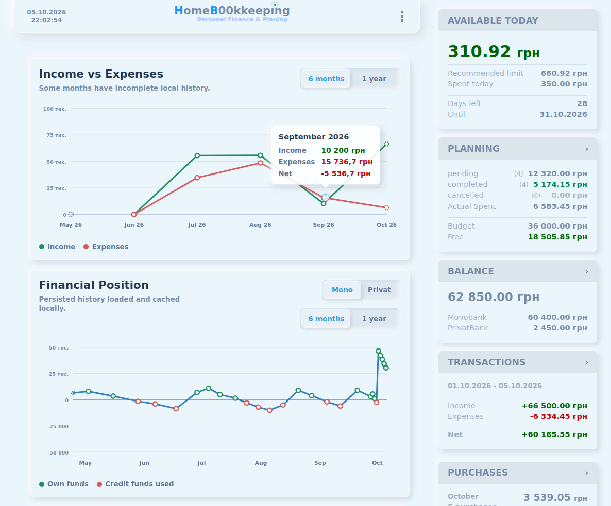
</p>

## Highlights

-   **Financial Planning** --- custom planning periods, budgets, planned
    expenses, Actual Spending, Plan vs Fact, and safe-to-spend
    calculations
-   **Product-aware Shopping Lists** --- canonical Products or free-text
    items, optional physical quantity and unit, checked state, offline
    persistence and synchronization
-   **Bank integrations** --- Monobank and PrivatBank balances and
    transactions
-   **Financial Analytics** --- Income vs Expenses, category spending,
    Financial Position, transaction drill-down, and local-history
    coverage awareness
-   **Purchases & Products** --- structured purchases, product catalog,
    categories, merchants, physical quantities, and factual prices
-   **Product Analytics** --- spending, purchased quantities, normalized
    unit prices, price history, recent purchases, and prices by store
-   **Receipt workflow** --- camera/gallery capture, private receipt
    storage, local Tesseract OCR, conservative parsing, Review, and
    conversion into Purchase + Purchase Items
-   **Smart Completion** --- suggests bank transactions that may
    correspond to planned expenses
-   **Local-first PWA** --- core financial data remains usable without a
    network connection
-   **Durable synchronization** --- queued local changes automatically
    synchronize after reconnect
-   **Multi-device conflict protection** --- server revalidation
    prevents silent overwrites
-   **IndexedDB persistence** --- balances, transactions, categories,
    Planning, Shopping Lists, Purchases, Products, receipts, and sync
    state are cached locally where applicable
-   **Local App Lock** --- optional PIN protection for the application
    UI
-   **Responsive UI** --- desktop browser and fullscreen mobile PWA
-   **Isolated environments** --- separate DEV and REAL Docker
    environments with synthetic development data

## Product Idea

Most personal-finance applications are strongest at answering:

> Where did my money go?

HBOO also focuses on:

-   How much can I safely spend today?
-   How much is reserved for future expenses?
-   What did I plan to spend vs. what did I actually spend?
-   What products did I plan to buy vs. what did I purchase?
-   How much of a product did I buy over time?
-   How have product prices changed between stores and periods?
-   How is my financial position changing over time?

The long-term goal is to connect four layers:

``` text
Current State
Balances / assets
      ↓
Planning
Periods / expenses / Shopping Lists
      ↓
Fact
Transactions / receipts / purchases / products
      ↓
Forecast & Insights
Safe-to-spend / future cash flow / spending optimization
```

## Tech Overview

``` text
Installed PWA / Browser
          │
          ▼
   Vanilla JavaScript
          │
    Stores / Services
          │
     ┌────┴─────┐
     ▼          ▼
 IndexedDB   Node.js API
                 │
            ┌────┴────┐
            ▼         ▼
          MySQL    Spring Boot
                       │
                 ┌─────┴─────┐
                 ▼           ▼
             Monobank    PrivatBank
```

**Frontend:** Vanilla JavaScript, ES Modules, IndexedDB, Service Worker,
Web App Manifest, Web Crypto, CSS/SASS

**Backend:** Node.js using native `node:http`, REST API, MySQL

**Bank integration:** Java, Spring Boot, Monobank API, PrivatBank API

**Receipt OCR:** Tesseract OCR (`ukr+eng`) running locally in the
backend environment

**Infrastructure:** Docker, Docker Compose, Nginx, HTTPS, MySQL 8

The main frontend and Node.js backend intentionally avoid application
frameworks. The frontend uses its own Router / Page / Store / Service /
Repository structure, while the backend is built directly on `node:http`
without Express, NestJS, or an ORM.

## Local-First Architecture

HBOO is designed so that temporary loss of the backend or internet
connection does not make the core application unusable.

``` text
App shell             → Service Worker / Cache Storage
Financial data        → IndexedDB
Planning changes      → Local state + durable sync queue
Shopping Lists        → Planning local-first synchronization
Purchases             → Local persistence + durable synchronization
Receipt drafts        → IndexedDB Blob + durable upload
Bank refresh          → Online integration
Smart Completion      → Online enrichment
OCR / Receipt Review  → Backend-required processing
```

Previously loaded balances, transactions, categories, Products,
Purchases, Planning data, and supported receipt data remain available
locally.

Planning synchronization performs server revalidation before pushing
local changes. Independent changes can synchronize while conflicting
modifications are stopped instead of silently overwriting data.

## Screenshots

### Planning & Safe-to-Spend

Planning is based on a **user-defined spending budget**, not directly on
the total bank balance.

<p align="center">
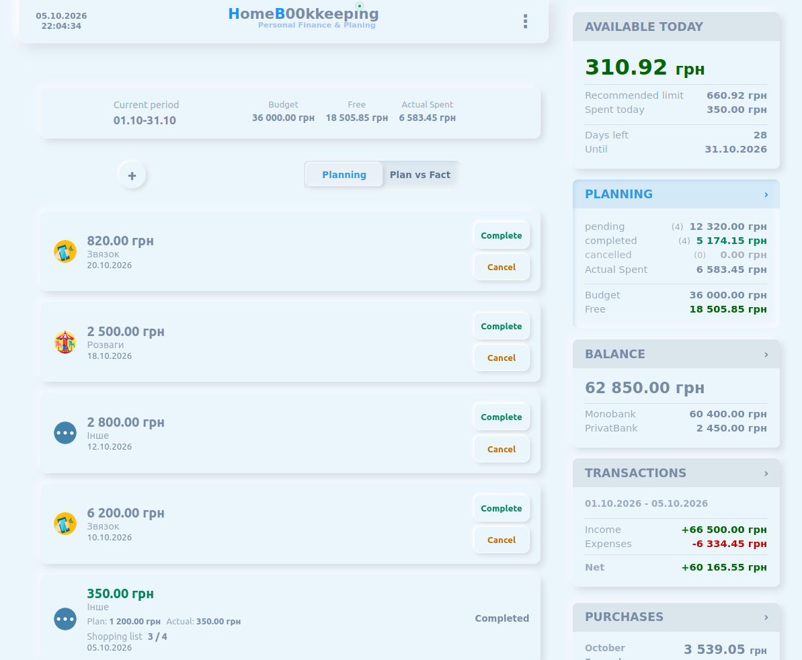
</p>

The current period exposes Budget, Free amount, Actual Spent,
Recommended Limit, Available Today, and the number of days remaining.

Planning periods have an explicit lifecycle. When a planned date range
ends, the period is not silently completed: it can be extended or the
user can explicitly start a new period. Historical items remain attached
to their original period.

### Plan vs Fact

Plan vs Fact compares completed planned expenses with actual spending.


<p align="center">
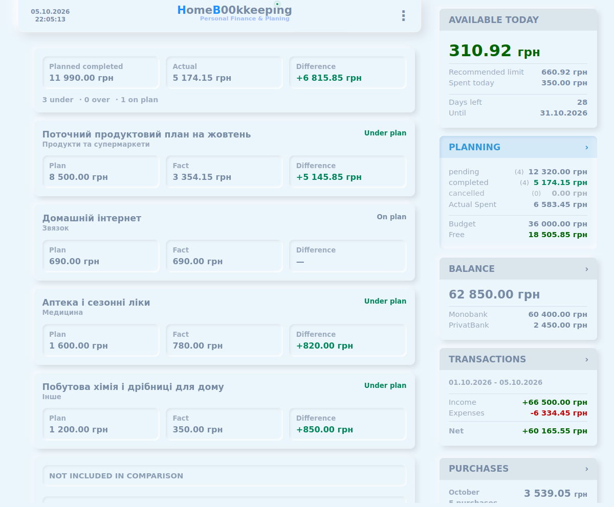
</p>

It provides a foundation for comparing expected and factual spending
while preserving Planning as a future-looking financial tool.

### Transactions

<p align="center">
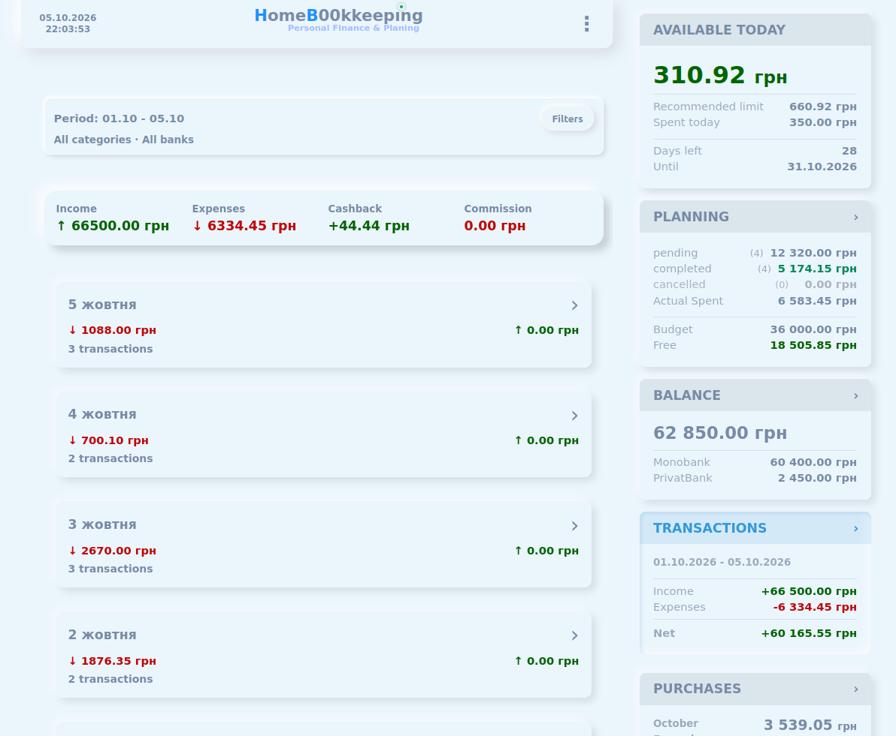
</p>

Transactions support multiple banks, date/category filtering, grouping
by day, income/expense summaries, local range queries, manual refresh,
and offline browsing of cached history.

### Purchases

<p align="center">
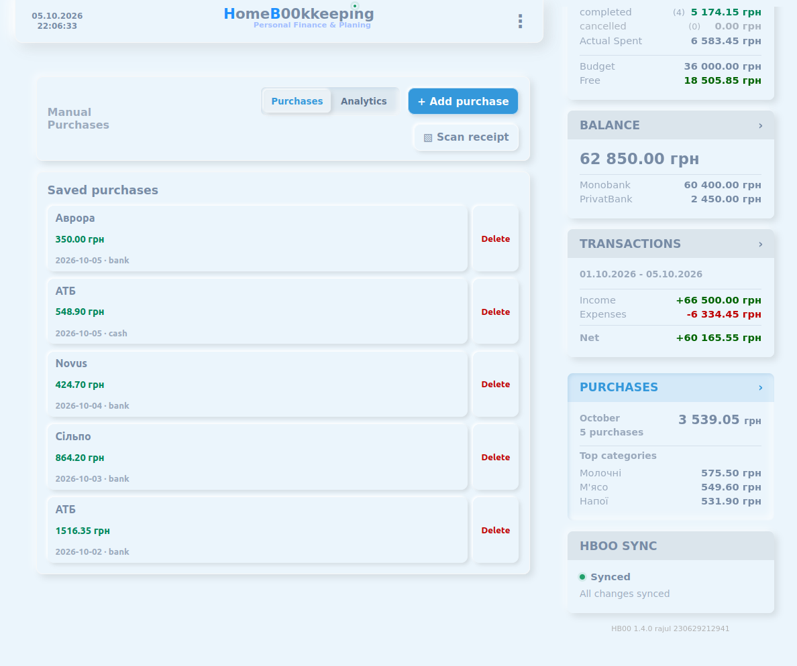
</p>

A Purchase represents factual item-level spending and may contain
multiple Purchase Items. Cash/manual purchases can exist independently
from bank transactions and receipts.

### Product Analytics

<p align="center">
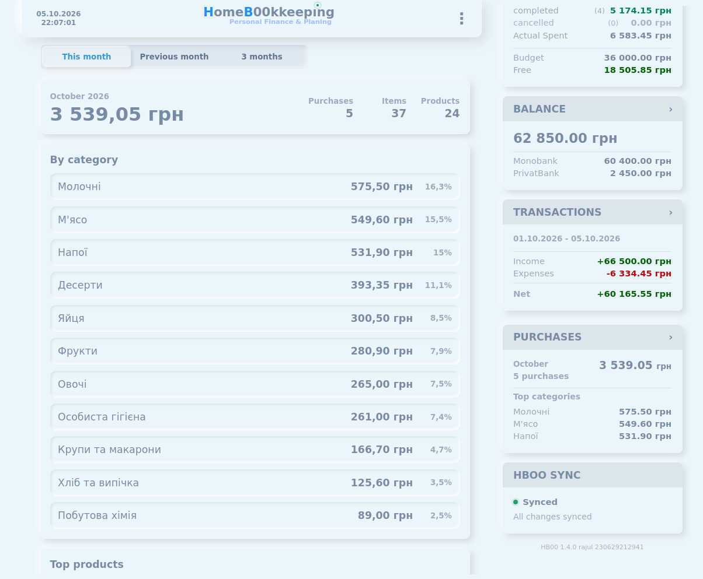
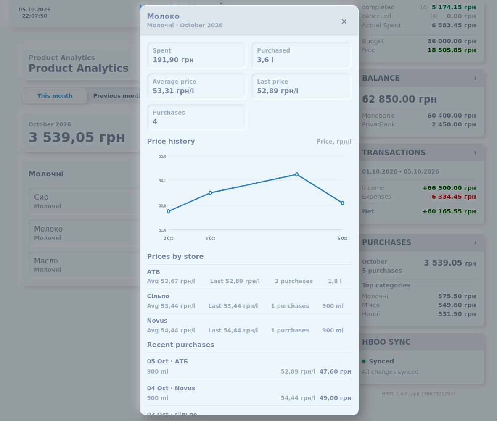
</p>

Product Analytics supports:

-   spending by product category
-   total purchases / items / Products
-   purchased physical quantities
-   Product Detail
-   normalized price per `kg`, `l`, or `pcs`
-   price history
-   prices by store
-   recent purchases
-   period selection

Physical quantity and money are intentionally separate concepts. For
example:

``` text
Milk
Amount: 900 ml
Price: 46.50 UAH

Normalized analytics price:
51.67 UAH/l
```

### Receipt OCR & Review

<p align="center">
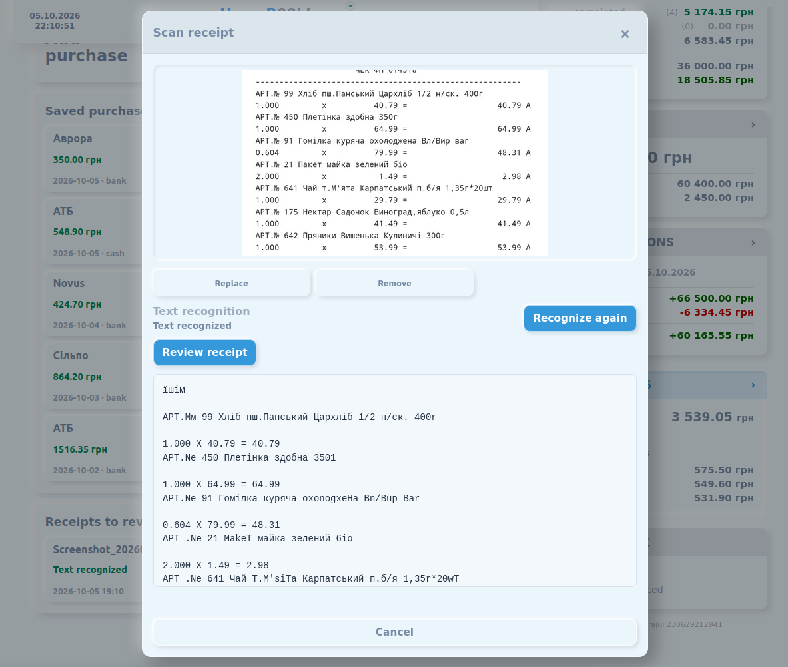
</p>

The receipt pipeline is implemented as:

``` text
Capture / Gallery
      ↓
Offline receipt draft
      ↓
Private server storage
      ↓
Local Tesseract OCR
      ↓
Conservative receipt parser
      ↓
Review / correction
      ↓
Explicit Product selection
      ↓
Purchase + Purchase Items
```

OCR raw text is retained as evidence. Parsing does not silently repair
suspicious financial values, and Product selection remains explicit
rather than aggressively auto-matching uncertain OCR text.

## Mobile PWA

HBOO is designed for desktop financial analysis and practical mobile
use.

<p align="center">
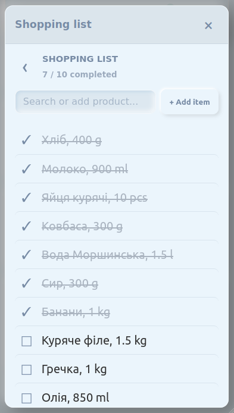
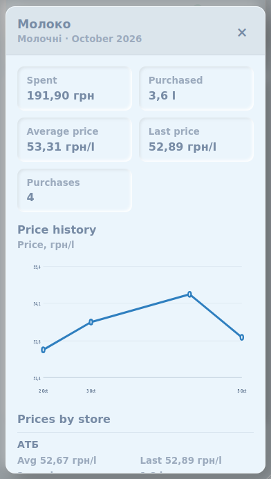
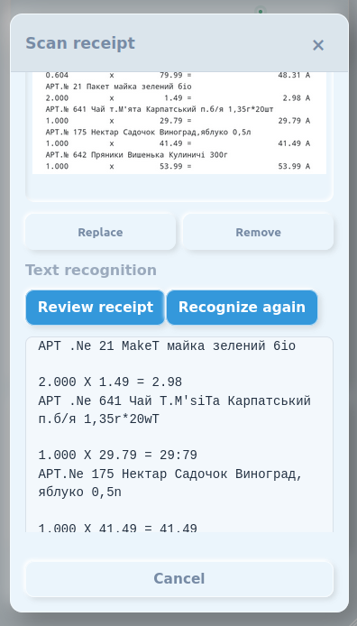
</p>

The mobile workflow is especially useful for Shopping Lists, checking
Product history while shopping, and capturing receipts.

The installed PWA supports fullscreen operation and offline startup.

## Financial Planning

Planning items represent concrete expected expenses rather than category
budgets.

Current functionality includes:

-   custom Planning Periods
-   period budgets
-   explicit creation of a new period
-   extension/editing of the current period
-   historical period preservation
-   planned expenses and categories
-   pending / completed / cancelled states
-   Actual Spending
-   remaining budget
-   recommended daily spending
-   Available Today
-   offline create / edit / complete / cancel
-   durable autosync after reconnect
-   multi-device revalidation and conflict protection
-   Shopping Lists attached to Planning items
-   Product autocomplete from the local Product catalog
-   canonical Product references or free-text Shopping List items
-   optional planned physical amount/unit
-   checked/unchecked Shopping List state
-   manual Planning ↔ bank transaction matching
-   Smart Completion suggestions

## Shopping Lists

Shopping Lists are part of Planning rather than a separate temporary
checklist.

A list can contain:

``` text
Milk             900 ml
Bread            400 g
Eggs              10 pcs
Chicken fillet   1.5 kg
Buckwheat          1 kg
Oil              850 ml
```

`Amount + Unit` represent the **planned physical quantity**, not money.

The approximate financial budget remains on the Planning item itself.

Shopping List items can reference a canonical Product or remain free
text. This keeps the fast in-store checklist workflow while preparing
HBOO for future Product-level Plan vs Fact analysis.

## Bank Balances

HBOO provides a unified overview of:

-   Monobank
-   PrivatBank
-   aggregated current balance
-   individual bank balances
-   balance history
-   manual bank synchronization
-   locally cached balance snapshots
-   data freshness
-   offline access to the last known balance


<p align="center">
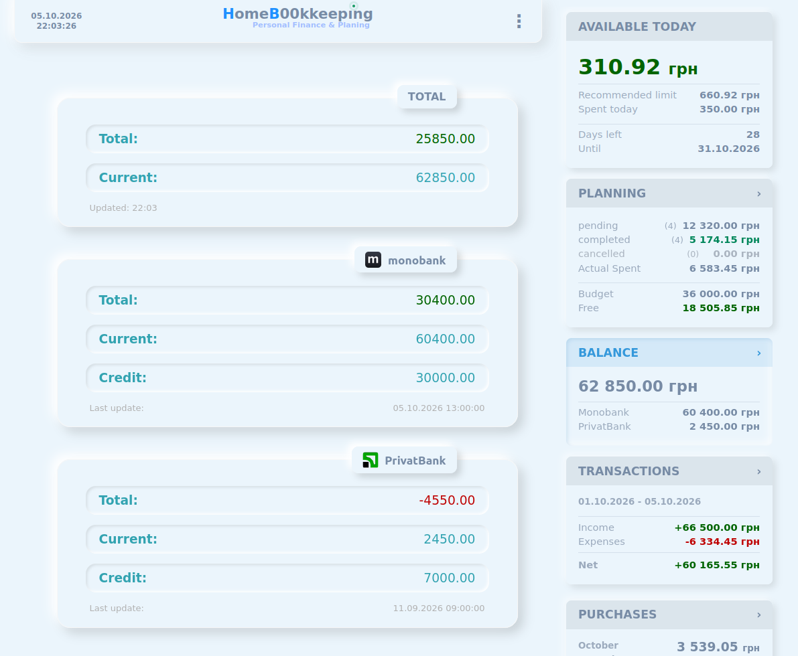
</p>

## Home Analytics & Financial Position

Home is a read-only local-first projection over data already stored by
HBOO. Opening Home does not trigger bank synchronization.

Current analytics include:

-   Income vs Expenses for 6- and 12-month periods
-   monthly Income / Expenses / Net
-   spending by category
-   custom-period analysis
-   category-to-Transactions drill-down
-   Financial Position / balance history
-   complete / partial / unavailable local-history awareness
-   offline analytics from cached transaction history

Missing history is represented explicitly instead of silently treating
missing data as zero.

## Planning and Transaction Matching

HBOO can associate planned expenses with persisted bank transactions.

Manual linking remains available as a fallback.

### Smart Completion

Smart Completion ranks likely transactions using signals such as:

-   merchant similarity
-   category
-   date
-   amount proximity

The matcher intentionally prefers missing an uncertain suggestion over
presenting an aggressive false positive.

Suggestions are advisory. A transaction is attached only after explicit
confirmation.

## Purchases and Product Model

The Product domain is separate from financial categories.

``` text
Purchase
   └── Purchase Items
          └── Product
                 └── Product Category
```

Purchases also reference a Merchant where known.

Product measurements use physical units:

-   weight --- `g`, `kg`
-   volume --- `ml`, `l`
-   count --- `pcs`

The factual price belongs to the full physical amount purchased.
Normalized unit price is derived for analytics rather than entered
manually.

## Receipt Processing

Standalone receipts can be captured before a Purchase exists.

``` text
Receipt
  purchase_id = NULL
      ↓
OCR
      ↓
Parse
      ↓
Review
      ↓
Create Purchase
      ↓
receipt.purchase_id = Purchase.id
```

Receipt capture is offline-first: the image is prepared in the browser,
stored in IndexedDB, and synchronized to private backend storage when
connectivity is available.

Tesseract runs locally in the HBOO backend environment rather than
sending private receipt images to a cloud OCR provider.

The parser preserves OCR evidence and uses conservative
arithmetic/context validation. Plausible but suspicious OCR numbers are
not silently trusted.

## PWA and Offline Operation

Current offline capabilities include:

-   installable PWA
-   offline cold start
-   last known Balance
-   cached Transactions
-   cached Categories
-   cached Product catalog
-   Planning read/create/edit/complete/cancel
-   Planning Period creation/editing
-   Shopping Lists
-   durable queued Planning synchronization
-   local Purchase workflows supported by the current sync model
-   receipt draft persistence
-   automatic synchronization after connectivity/authentication recovery

Bank synchronization, Smart Completion, OCR execution, and server-side
Receipt Review operations require backend connectivity.

## Local-First Data Flow

``` text
Page / Component
       │
       ▼
     Store
     /   \
    ▼     ▼
 Local    API
Repository Service
    │       │
    ▼       ▼
IndexedDB Backend
```

Local data can be rendered immediately while network operations enrich
or synchronize it when connectivity is available.

## Planning Synchronization

Planning uses a durable local synchronization queue. Local edits survive
page reloads and connectivity loss.

Before pushing dirty Planning state, HBOO compares:

``` text
BASE   = last known server snapshot
LOCAL  = current IndexedDB state
REMOTE = fresh server state
```

Independent changes can synchronize while overlapping changes are
stopped as conflicts instead of silently overwriting remote data.

## Connection and Sync Status

The UI distinguishes:

``` text
Synced
Syncing...
Offline
Sign in to sync
Sync error
Sync conflict
```

## Authentication and Local App Lock

Backend authentication and local application access are separate
concerns.

If the API session expires, HBOO can continue using local data.
Re-authentication does not discard the current route or offline state.

HBOO can optionally protect the local UI with a PIN. The verifier is
derived locally using Web Crypto PBKDF2 with SHA-256 and a random salt.
The plaintext PIN is not persisted.

App Lock is an application UI access layer, not encryption at rest.

## Repository Structure

``` text
frontend/
    Vanilla JavaScript HBOO client

backend/
    Pure Node.js REST API

bank-service/
    Spring Boot bank integration service

docker/
    Docker / Nginx / MySQL infrastructure

compose.yaml
    DEV-only local application environment

.env.example
    DEV example environment configuration without secrets
```

## Frontend Architecture

The frontend is built with **Vanilla JavaScript** without React, Vue,
Angular, or another frontend framework.

This is intentional: HBOO implements its own application structure and
works directly with browser mechanisms rather than relying on framework
abstractions.

``` text
HBOO
├── Application Core
├── Router
├── Pages
│   ├── Home
│   ├── Balance
│   ├── Transactions
│   ├── Planning
│   ├── Purchases
│   ├── Product Analytics
│   ├── Deposits
│   └── Settings
├── Components
├── Stores
├── Services
├── Local Repositories
├── API Services
└── Reusable UI Helpers
```

## DEV Local Environment

`compose.yaml` is DEV-only. Running `docker compose up -d` from this
repository must always mean the isolated development environment with
synthetic data.

Prerequisites:

-   Docker
-   Docker Compose
-   mkcert

``` text
https://dev.hboo.local
    → hboo-dev-nginx
    → frontend/
    → hboo-dev-backend
    → hboo-dev-mysql
    → hboo_dev
    → synthetic data only
```

Adminer:

``` text
http://dev.hboo.local:8080
```

Configure the DEV hostname:

``` bash
sudo sh -c 'echo "127.0.0.2 dev.hboo.local" >> /etc/hosts'
```

Generate local HTTPS certificates:

``` bash
mkcert -install
mkcert \
  -cert-file docker/nginx/certs/dev.hboo.local.pem \
  -key-file docker/nginx/certs/dev.hboo.local-key.pem \
  dev.hboo.local localhost 127.0.0.2
```

Start / stop:

``` bash
docker compose up -d
docker compose down
```

Open:

``` text
https://dev.hboo.local/
```

DEV uses `hboo_dev` and synthetic financial data only. Local database
dumps and real credentials must not be committed.

## REAL Runtime and Deployment

REAL is a deployment target, not the active development working tree.

Safe runtime templates live under `docker/runtime-example/`. REAL uses
separate configuration, credentials, database, network, volumes,
hostname, and deployment checkout.

``` text
working tree
    → DEV
    → validate with synthetic data
    → commit
    → merge/push
    → clean REAL checkout
    → reviewed DB migrations
    → rebuild/recreate affected services
    → smoke test
```

REAL credentials and financial data are never part of the repository.

## Database Migrations

``` text
create migration
    → apply/test against hboo_dev
    → commit with application code
    → backup REAL database
    → apply reviewed migration to REAL
    → deploy compatible application version
```

DEV bootstrap data is deterministic and synthetic so the application can
be used for development, analytics validation, and portfolio screenshots
without exposing real financial information.

## Roadmap

The next stages focus on connecting Planning, bank facts, Purchases,
Products, and forecasting into one explainable financial model.

### Planning → Fact linkage

-   optional structured Merchant / Store on Planning items
-   robust Purchase ↔ Bank Transaction linking
-   complete Planning ↔ Transaction ↔ Purchase / Receipt chain
-   improved transaction and receipt candidate ranking
-   Product matching using OCR evidence, aliases, Shopping List context,
    merchant, and purchase history
-   user-confirmed Product aliases as a recognition dictionary
-   Product-level Plan vs Fact:
    -   planned and purchased
    -   planned but not found
    -   additional purchases

### Deeper statistics

-   spending totals for arbitrary periods
-   comparisons between periods
-   average daily / weekly / monthly spending
-   spending trends by financial category
-   spending trends by Product category
-   Merchant / store spending statistics
-   Product quantities purchased over time (`kg`, `l`, `pcs`)
-   price inflation / price-change views by Product
-   recurring expense detection
-   subscription and regular-payment insights
-   long-term balance and net cash-flow statistics

The goal is not only to show individual transactions, but to answer
questions such as:

> How much did I spend during the last 30 / 90 / 365 days?

> Which categories, stores, and Products changed my spending the most?

> Is my average monthly spending increasing or decreasing?

### Forecast Engine

A deterministic, explainable forecast is planned before any AI-based
forecasting.

The forecast can combine:

``` text
Current balance
+ known future income
- explicit Planning items
- recurring expenses
- expected historical spending
= projected future balance
```

Planned outputs include:

-   projected balance over time
-   expected spending until the next income
-   minimum projected balance
-   future risk periods
-   expected Free / Available amount
-   warnings when planned spending is likely to require credit funds
-   What-if scenarios such as:
    -   "Can I buy this for 8,000 UAH on October 15?"
    -   "Will I remain above my reserve until salary?"

### Spending Optimization

A future Insights layer can help answer:

-   Where can spending be reduced without breaking mandatory plans?
-   Which categories consistently exceed their normal level?
-   Which purchases or subscriptions are recurring but low-value?
-   Which stores are usually more expensive for Products I regularly
    buy?
-   How much should be reserved to avoid using credit funds before the
    next income?
-   What daily spending limit would keep the projected balance above a
    configured reserve?
-   Which planned expense could be postponed with the smallest impact?

Recommendations should remain explainable: HBOO should show the data and
assumptions behind a suggestion rather than presenting a black-box
instruction.

### AI-assisted Insights

AI integration is a possible later layer, not a dependency of the core
financial model.

Potential uses include:

-   natural-language questions about personal financial history
-   summaries of spending changes between periods
-   explanation of unusual spending patterns
-   assistance with transaction / Purchase / Product categorization
-   receipt/Product matching assistance for uncertain cases
-   personalized spending optimization suggestions
-   explanation of forecast risks and possible alternatives
-   conversational What-if analysis

Examples:

``` text
"Why did I spend more this month than last month?"

"How much did I spend on groceries during the last 3 months?"

"What expenses could I reduce to avoid using credit funds before salary?"

"How much can I safely spend this weekend?"

"Which products became noticeably more expensive?"
```

AI should work on top of deterministic HBOO data and calculations. Core
balances, totals, forecasts, and financial rules should remain
reproducible and understandable without AI.

### Other planned improvements

-   recurring Planning items
-   explicit carry-forward of selected unfinished Planning items into a
    new period
-   stronger server-side revision / ETag concurrency control
-   improved Planning conflict-resolution UI
-   broader offline financial calculations
-   savings / financial goals
-   PWA notifications
-   migration tracking and deployment hardening
-   further Receipt OCR/parser improvements based on real-world evidence

## Security and Data Safety

HBOO works with financial data, so DEV and REAL environments are
intentionally isolated.

-   no REAL credentials in Git
-   no real bank tokens in DEV
-   DEV uses synthetic financial data
-   REAL uses a separate database and runtime
-   generated certificates and private keys are not committed
-   database migrations are reviewed before REAL execution
-   transaction imports use provider transaction IDs to prevent
    duplicate imports
-   receipt images are stored privately rather than as public static
    assets
-   local OCR avoids sending receipt images to third-party cloud OCR
    services

## Project Background

HBOO was originally designed and implemented independently from scratch
before I started actively using AI coding assistants.

The original architecture, frontend core, routing, components, financial
model, bank integration approach, and UI were developed through the
normal product and engineering process rather than generated from a
predefined implementation.

Current development uses AI-assisted engineering where useful, while
product decisions, architecture, code review, security boundaries, and
validation remain developer-driven.

## Status

**Active development**

Current milestone:

-   local-first PWA
-   Monobank / PrivatBank synchronization
-   offline financial history
-   Planning Period lifecycle
-   durable Planning + Shopping List synchronization
-   Plan vs Fact
-   Purchases and Product catalog
-   Product Analytics and price history
-   standalone receipt capture
-   local OCR
-   receipt parsing and Review
-   Receipt → Purchase conversion
-   deterministic synthetic DEV dataset for safe development and demos

The next major milestone is to connect **Planning → Transaction →
Purchase / Receipt → Product** more deeply and use that factual history
for **forecasting, spending optimization, and explainable financial
insights**.
